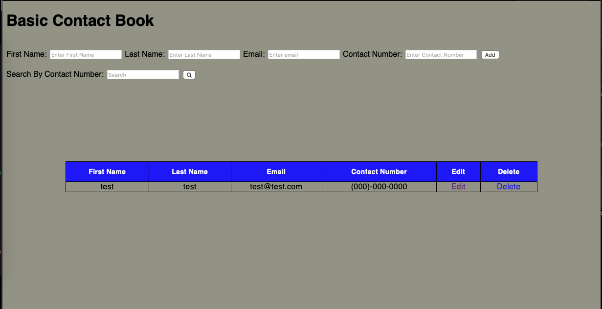

# Basic_Contact_App_Project
Building a system to handle the contacts

This is a project that needs prior knowledge of database concepts. This allows the user to add, edit, delete, view, and update contacts. This would be a starting project to practice database management in Python.

